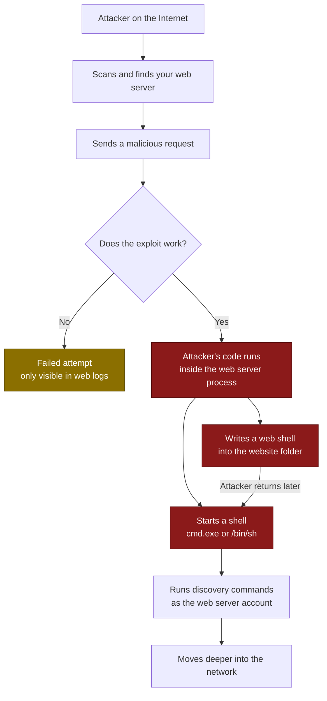

# T1190 — Exploit Public-Facing Application
 
| Field | Value |
|---|---|
| **ATT&CK ID** | T1190 |
| **Tactic** | Initial Access (TA0001) |
| **Related** | T1505.003 (Web Shell), T1059 (Command and Scripting Interpreter) |
| **Platforms** | Windows, Linux |
| **Version** | 2.0 — Starter ruleset |
| **Updated** | 2026-07-23 |
 
---
 
## 1. Technique Title
 
**T1190 — Exploit Public-Facing Application**
 
An adversary attacks a system that is reachable from the Internet — a web server, VPN appliance, or application server — and abuses a software flaw in it to run their own code inside your network.
 
---
 
## 2. Introduction
 
Your public-facing applications are designed to accept requests from strangers. That is their job. T1190 is what happens when an attacker sends a request that is crafted so that the application does something it was never meant to do — such as running a command on the operating system.
 
The vulnerability itself can be any of these:
 
- **Command injection** — user input gets pasted into a system command
- **Remote code execution** — untrusted data reaches a code path that executes it (Log4Shell is the famous example)
- **File upload flaws** — the attacker uploads a script into a folder the web server will execute
- **Path traversal or authentication bypass** — used to reach a protected function
**The key idea for detection engineering:** there are thousands of different vulnerabilities, and new ones appear every week. You cannot write a rule for each. But whichever flaw the attacker uses, the *result* is almost always one of two things:
 
1. The web server process starts a command shell, or
2. A script file appears in the website folder (a web shell)
Neither of these has a normal explanation on a healthy production server. So instead of chasing individual CVEs, you write rules for the **outcome**. Rules built this way detect attacks that were published yesterday and attacks that have not been published at all.
 
One more useful fact: the attacker's code runs as the *web server's own account* — `IIS APPPOOL\DefaultAppPool` on Windows, `www-data` or `apache` on Linux. These accounts have extremely boring, predictable behaviour. Anything unusual done by them is worth looking at.
 
---
 
## 3. Attack Flow
 
### 3.1 The Steps
 
| Step | What the attacker does | What you can see in logs |
|---|---|---|
| **1. Find the target** | Scans the Internet for your servers and identifies what software you run | Lots of requests from one IP to many different URLs; 404 errors |
| **2. Find the flaw** | Tests for known vulnerabilities in that software | Repeated odd requests to the same page; server errors (500s) |
| **3. Send the exploit** | Sends the malicious request that triggers the bug | Strange text in the URL or headers — `${jndi:`, `../../`, `;curl` |
| **4. Get code execution** | The application runs the attacker's command | **Web server process starts `cmd.exe` / `/bin/sh`** ← strongest signal |
| **5. Install a web shell** | Drops a small script in the website folder so they can come back later | **A `.aspx` / `.php` / `.jsp` file appears in the web root** |
| **6. Look around** | Runs commands to see where they landed | `whoami`, `ipconfig`, `net user` running as the web server account |
| **7. Spread** | Steals credentials and moves to other machines | *(Beyond T1190 — different detections take over here)* |
 
### 3.2 Flow Diagram
 

 
---
 
## 4. Detection Strategy
 
### 4.1 The Approach
 
Five rules cover the technique well. Four of them are **atomic** — they look at a single log event and decide on their own whether it is suspicious. No timers, no lookups, no state. This is what you want when you are starting out: atomic rules are easy to write, cheap to run, easy to explain to an analyst, and they keep working when you change SIEM platforms.
 
One **correlation** rule is included, because there is exactly one place where a single event genuinely cannot tell you enough on its own. That is explained in Section 6.
 
### 4.2 What You Need Logging
 
| Rule needs | Where it comes from |
|---|---|
| Process creation with parent process and command line | Sysmon Event ID 1, **or** Windows Security 4688 with command-line logging enabled via GPO |
| File creation events | Sysmon Event ID 11 — **check that your web folders are not excluded**, many default Sysmon configs exclude them |
| Linux process execution | auditd `execve` rule, Sysmon for Linux, or your EDR |
| Web server access logs | IIS (W3C format, with query string) or Apache/Nginx, forwarded to the SIEM |
 
If you only have one of these, start with **process creation**. It powers three of the five rules.
 
### 4.3 Atomic Rules
 
| ID | Rule | Log Source | Level | Alerts on its own? |
|---|---|---|---|---|
| **AR-01** | [Web Server Process Spawning Shell or Interpreter (Windows)](https://github.com/zshanhyder01/Detection-Engineering/blob/main/atomic_rules/windows/detect_webserver_spawn_interpreter_win/sigma.yml) | `process_creation` / windows | High | Yes |
| **AR-02** | [Web Server Process Spawning Shell (Linux)](https://github.com/zshanhyder01/Detection-Engineering/blob/main/atomic_rules/linux/detect_webserver_spawn_interpreter_linux/sigma.yml) | `process_creation` / linux | High | Yes |
| **AR-03** | [Web Shell Written to Website Folder](https://github.com/zshanhyder01/Detection-Engineering/blob/main/atomic_rules/windows/detect_webshell_write_to_webroot/sigma.yml) | `file_event` / windows | High | Yes |
| **AR-04** | [Common Exploit Patterns in Web Server Logs](https://github.com/zshanhyder01/Detection-Engineering/blob/main/atomic_rules/web_server/detect_webserver_exploit_attempt/sigma.yml) | `webserver` | Medium | No — noisy, use for context |
| **AR-05** | [Discovery Commands Run by Web Server Account](https://github.com/zshanhyder01/Detection-Engineering/blob/main/atomic_rules/windows/detect_discovery_under_web_identity/sigma.yml) | `process_creation` / windows | Medium | Yes, after tuning |

 
**What each one gives you:**
 
- **AR-01** is the most important rule in this document. A web server exists to answer web requests. It has no reason to launch `cmd.exe`. This one rule catches web shell usage, command injection, and remote code execution — no matter which vulnerability was used.
- **AR-02** does the same job on Linux, where most public web servers actually run. It needs more tuning than AR-01, because Linux web applications sometimes do legitimately call shell commands.
- **AR-03** catches the attacker installing a way back in. Importantly, it still fires when the attack produced **no new process at all** — such as a file upload vulnerability where the attacker just drops the file and comes back later. It is the backup for AR-01 and AR-02.
- **AR-04** shows you attack attempts arriving at the server. It is far too noisy to alert on, because the Internet scans everything constantly. Its value is that when a real compromise is confirmed by AR-01 or AR-03, this rule tells you **which source IP and which page** were used to get in.
- **AR-05** catches the attacker orienting themselves after breaking in. It keys on the *account* rather than the parent process, which means it also catches commands run two or three steps down the chain (`w3wp.exe` → `cmd.exe` → `whoami.exe`).
### 4.4 Correlation Rules
 
Only one is needed, and only because of a specific weakness in AR-03.
 
| ID | Rule | Combines | Level |
|---|---|---|---|
| **CR-01** | Web Shell Written and Then Used | AR-03 → (AR-01 or AR-05) | Critical |
 
AR-03 fires whenever a script file appears in a website folder. Most of the time that is an attacker — but sometimes it is a developer or a deployment tool doing the same thing. A single event cannot tell those apart. What *can* tell them apart is what happens next: if that server then starts running commands as the web server account, it was an attacker. That sequence is something no single log event contains, so a correlation rule is genuinely required here.
