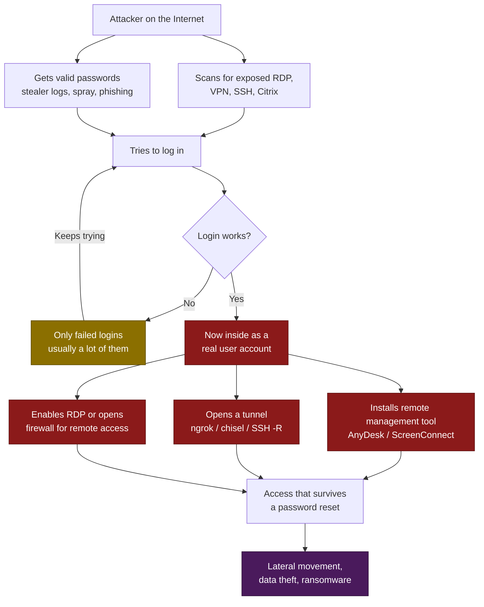

# T1133 — External Remote Services
 
| Field | Value |
|---|---|
| **ATT&CK ID** | T1133 |
| **Tactic** | Initial Access (TA0001), Persistence (TA0003) |
| **Related** | T1078 (Valid Accounts), T1219 (Remote Access Software), T1572 (Protocol Tunneling), T1021.001 (Remote Desktop Protocol) |
| **Platforms** | Windows, Linux, Network Appliances |
| **Version** | 1.1 — Starter ruleset |
| **Updated** | 2026-07-23 |
 
---
 
## 1. Technique Title
 
**T1133 — External Remote Services**
 
The attacker logs into your network using a remote access service that is open to the internet. RDP, VPN, Citrix, SSH. They use a real password that works. Or, if they are already inside, they install their own remote access tool so they can get back in later.
 
---
 
## 2. Introduction
 
This technique works differently from T1190 and T1189, and the difference matters for how you detect it.
 
In T1190 the attacker breaks something. In T1189 the attacker tricks a user. In T1133 the attacker does neither. They log in like a normal person, using a service you opened on purpose, with a password that actually works. Nothing is broken. Nothing looks malformed. The service sees a normal login and allows it, because that is what it was built to do.
 
Where do the passwords come from? Usually somewhere cheap:
 
- Infostealer logs bought online (often collected from a ClickFix infection on someone's home PC)
- Passwords reused from an old breach at some other company
- Password spraying against a service with no lockout policy
- A phishing page that captured the password and the MFA code together
There is a second half to this technique that people often forget. Once the attacker is inside, they usually **build their own remote access**. They install a normal commercial tool like AnyDesk or ScreenConnect, or they run a tunnelling tool like ngrok that opens a path back in from outside. Ransomware groups do this all the time. These tools are signed, they are legitimate software, many companies already use them, and application control almost never blocks them. So when the incident response team finally resets the stolen password, the attacker still has a way in.
 
### What this means for detection
 
There is no perfect rule for this one. In T1190 you had `w3wp.exe` starting `cmd.exe`. In T1189 you had the command sitting in the registry. Here you have nothing that clean, because a login is a login. It looks the same whether the password was typed by your finance manager or by someone who bought it on a forum.
 
What you can detect reliably:
 
1. Connections coming from places they should not come from
2. Remote access software running that nobody approved
3. Config changes that open remote access where there was none

---
 
## 3. Attack Flow
 
### 3.1 The Steps
 
| Step | What happens | What you see in logs |
|---|---|---|
| **1. Find the service** | Attacker scans the internet for open RDP, VPN portals, SSH, Citrix, or admin interfaces | Connection attempts to remote access ports from unknown IPs |
| **2. Get passwords** | Bought from stealer logs, reused from a breach, phished, or sprayed | Lots of failed logins, often across many accounts |
| **3. Log in** | Attacker authenticates successfully, sometimes on the first attempt | **Successful login from a public IP** ← main signal |
| **4. Look around** | Basic discovery to see where they landed | Discovery commands soon after a remote login |
| **5. Build their own access** | Install a remote management tool or open a tunnel, so access survives a password reset | **Unapproved remote access tool running**; **tunnelling tool running** |
| **6. Open the door wider** | Enable RDP, add a firewall rule, create a local account | **`netsh` or registry changes that enable remote access** |
| **7. Do the damage** | Move around the network, steal data, deploy ransomware | *(Different techniques take over here)* |
 
### 3.2 Flow Diagram
 

 
---
 
## 4. Detection Strategy
 
### 4.1 The Approach
 
Detection here splits into two parts. The second part is where most of the reliable value is.
 
**Part one is the login side.** Who logged in, and from where. This is useful but limited. A successful login looks the same no matter who typed the password. The one case that is clearly wrong is a remote login coming straight from a public IP address, which should not happen on a well designed network.
 
**Part two is the tools and config side.** Remote access software and settings that should not be on the machine. This is much more reliable, because there is no ambiguity here. Nobody installs ngrok by accident. A `netsh` command opening the firewall for RDP was run by your admin or by your attacker, and there are usually only a few people it could have been. Three of the five rules below are in this group.
 
Four rules alert on their own. One is noisy on purpose and only feeds the correlation rule.
 
### 4.2 What You Need Logging
 
| Rule needs | Where it comes from |
|---|---|
| Successful and failed logins with source IP | Windows Security 4624 and 4625, from **domain controllers and any host that can be reached remotely** |
| Process creation with command line | Sysmon Event ID 1, or Security 4688 with command line logging turned on |
| Registry writes | Sysmon Event ID 13 (only for the AR-04 variant described later) |
 
### 4.3 Important Limit — Your VPN Box Is Not Covered
 
**These rules cover Windows. They do not cover your VPN appliance.**
 
A Fortinet, Palo Alto, Cisco ASA or Citrix box does not write to the Windows Security log. It writes syslog in its own format, and Sigma has no standard log source for that. So if VPN is the main way people reach your network, and for most companies it is, the login rules here only see part of the picture.
 
That is not a reason to skip them. RDP exposed to the internet is still one of the most common ways ransomware gets in, and rules AR-02 to AR-04 work no matter how the attacker arrived. But be honest about the gap. Full coverage means pulling your VPN logs into the SIEM and writing the same logic there in your SIEM's own query language.
 
### 4.4 Atomic Rules
 
| ID | Rule | Log Source | Level | Alerts on its own? |
|---|---|---|---|---|
| **AR-01** | Successful RDP Logon from a Public IP Address | `windows/security` | High | Yes |
| **AR-02** | Unsanctioned Remote Access Tool Running | `process_creation` | High | Yes |
| **AR-03** | Network Tunnelling Tool Executed | `process_creation` | High | Yes |
| **AR-04** | Remote Access Enabled by Configuration Change | `process_creation` | High | Yes |
| **AR-05** | Failed Logon to a Remote Service | `windows/security` | Low | No — correlation input |
 
What each rule does for you:
 
- **AR-01** catches the simplest version of this attack: someone using RDP straight from the internet. If your company sends all remote access through a VPN or gateway, this should never happen, so the rule is accurate. It also tends to show you exposed machines you did not know about.
- **AR-02** catches the attacker installing their own way back in. Commercial remote management tools are the favourite persistence method in ransomware cases, because they are signed and legitimate and nothing blocks them. This rule is really an inventory question: you approve one tool, everything else is an alert.
- **AR-03** catches tunnelling tools. These solve a specific problem for the attacker, which is reaching a machine that has no open port. Tools like ngrok and chisel connect **outward**, which the firewall allows, and then push traffic back in through that connection. There is basically no reason for these to be on a normal company machine.
- **AR-04** catches the attacker opening the door wider. Enabling RDP, adding a firewall rule, setting up a port forward. Each of these is one command with distinctive text, and very few people run them legitimately.
- **AR-05** records failed logins. On its own it is just noise, because every exposed service gets guessed at all day long. Its whole value is in the correlation rule.
### 4.5 What These Rules Do Not Cover
 
Worth saying clearly, because a coverage map that claims too much is worse than no map at all.
 
**If someone uses a stolen password from a normal looking location, nothing here will catch it.** Say an attacker buys your user's VPN password from a stealer log and connects from a home internet connection in the same country during working hours. There is nothing in the Windows logs that separates them from the real user. Sigma cannot fix this, because the information is simply not in the logs these rules read.
 
That case belongs to your identity provider. Entra ID Protection, Okta ThreatInsight, and similar products already do this well, using baseline data your SIEM does not have. Impossible travel, unknown device, odd sign-in properties, token problems.
 
**The right way to handle it is to take their risk verdict as an event and alert on that**, instead of trying to rebuild that logic in Sigma. A rule matching a high risk sign-in from your IdP is short, atomic, and far more accurate than anything you would write yourself.
 
So: these five rules cover the Windows side of T1133, and your IdP covers the identity side. Neither one is complete alone.
 
### 4.6 Correlation Rules
 
One correlation rule.
 
| ID | Rule | Combines | Level |
|---|---|---|---|
| **CR-01** | Password Guessing Followed by Successful External Logon | AR-05 (repeated) → AR-01 | Critical |

