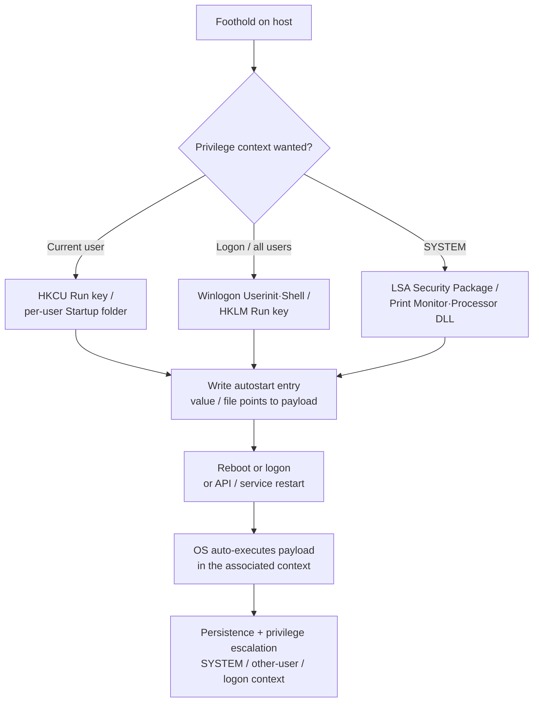

# T1547 — Boot or Logon Autostart Execution

> **MITRE ATT&CK**
> **Technique:** [T1547 — Boot or Logon Autostart Execution](https://attack.mitre.org/techniques/T1547/)
> **Sub-techniques covered:** [.001 Registry Run Keys / Startup Folder](https://attack.mitre.org/techniques/T1547/001/), [.002 Authentication Package](https://attack.mitre.org/techniques/T1547/002/), [.004 Winlogon Helper DLL](https://attack.mitre.org/techniques/T1547/004/), [.005 Security Support Provider](https://attack.mitre.org/techniques/T1547/005/), [.010 Port Monitors](https://attack.mitre.org/techniques/T1547/010/), [.012 Print Processors](https://attack.mitre.org/techniques/T1547/012/)
> **Tactics:** Persistence (TA0003), Privilege Escalation (TA0004)
> **Platforms:** Windows

---

## 1. Technique Title

**Boot or Logon Autostart Execution (T1547)**

---

## 2. Introduction

Windows provides many mechanisms that automatically execute programs when the system boots or when a user logs on. Adversaries abuse these mechanisms to gain **persistence** (their code runs again after a reboot) and, for the locations that execute in a privileged context, **privilege escalation** (their code runs as `SYSTEM` or in another user's session).

The technique works by **writing an autostart entry** — a registry value or a file in a startup folder — that references the attacker's payload. The operating system reads that entry during the boot or logon sequence and launches the referenced program in a specific security context that depends on the location chosen:

- **Registry Run keys / Startup folder (.001)** — the value/file runs at user logon. `HKCU` runs for that user; `HKLM` Run keys and the *All Users* startup folder run for **every** user who logs on.
- **Winlogon Helper (.004)** — `Userinit`, `Shell`, and `Notify` values run during the interactive logon sequence, before/around the user's shell.
- **Security Support Provider / Authentication Package (.005 / .002)** — DLLs listed under `HKLM\SYSTEM\CurrentControlSet\Control\Lsa` are loaded into **`lsass.exe` (SYSTEM)** at boot.
- **Port Monitors / Print Processors (.010 / .012)** — DLLs registered under the print spooler keys are loaded by **`spoolsv.exe` (SYSTEM)**.

The common thread — and what makes this technique highly detectable — is that every autostart location is a **discrete, well-known registry key or file path** that is rarely modified on a healthy system. A single write to one of these locations is, by itself, a high-fidelity signal. That property is why detection here is predominantly **atomic** (see Section 6 for why correlation is not required).

---

## 3. Attack Flow

**Step-by-step:**

1. **Obtain the required access.** User-level locations (`HKCU` Run keys, the per-user startup folder) need only that user's rights; privileged locations (`HKLM` Run keys, Winlogon, LSA packages, print spooler) require local administrator.
2. **Choose an autostart location** based on the desired trigger (boot vs logon) and the **privilege context** the payload should run in (current user, every user, logon context, or SYSTEM).
3. **Stage the payload** — often in a user-writable directory (`\Temp`, `\AppData`, `\ProgramData`) or as a DLL to be side-loaded by a privileged host process.
4. **Write the autostart entry** — set a registry value (Run key, Winlogon, LSA package list, spooler `Driver` value) or drop a file into a startup folder, pointing it at the payload.
5. **Trigger execution.** On the next reboot or logon, the OS reads the entry and launches the payload in the associated context. LSA/SSP and print-spooler DLLs can also be loaded immediately via API (`AddSecurityPackage`) or a service restart.
6. **Outcome:** persistence across reboots, plus privilege escalation to SYSTEM or another user's session for the privileged locations.

**Flow diagram:**

**Data sources that observe this flow:**

| Data Source | Event | What it provides |
|---|---|---|
| **Sysmon** | **EID 13** | Registry value set — Run keys, Winlogon values, LSA package lists, spooler `Driver` values (`TargetObject`, `Details`, `Image`) |
| **Sysmon** | **EID 11** | File create — drops into Startup folders (`TargetFilename`, `Image`) |
| **Sysmon** | **EID 7** | Image load — DLL loaded into `lsass.exe` / `spoolsv.exe` (execution confirmation) |
| Windows **Security** log | **4657** | Registry value modified (requires a **SACL** on the audited key) |

---

## 4. Detection Strategy

Detection is built entirely from **atomic rules**, one per autostart surface. Each rule matches a single registry write or file create to a specific, rarely-modified location and validates the value/path is suspicious. Because these locations carry the signal in a single event, **no correlation rules are required** for this technique — the rationale is documented in Section 6.

### 4.1. Atomic Rules

| # | Rule Name | Source Event | Sub-tech | How it helps detection |
|---|---|---|---|---|
| 1 | `autostart_run_key_t1547` | Sysmon EID 13 | .001 | Flags Run/RunOnce values set to a user-writable path, LOLBin, or encoded payload. |
| 2 | `autostart_startup_folder_t1547` | Sysmon EID 11 | .001 | Detects executable/script/shortcut files dropped into a Startup folder. |
| 3 | `autostart_winlogon_helper_t1547` | Sysmon EID 13 | .004 | Detects tampering with Winlogon `Userinit`/`Shell`/`Notify` (logon-context execution); default values filtered. |
| 4 | `autostart_lsa_package_t1547` | Sysmon EID 13 | .005 / .002 | Detects changes to LSA Security/Authentication/Notification package lists — DLLs loaded into `lsass.exe` (SYSTEM). |
| 5 | `autostart_print_spooler_dll_t1547` | Sysmon EID 13 | .012 / .010 | Detects registration of a Print Processor / Port Monitor DLL loaded by `spoolsv.exe` (SYSTEM). |
