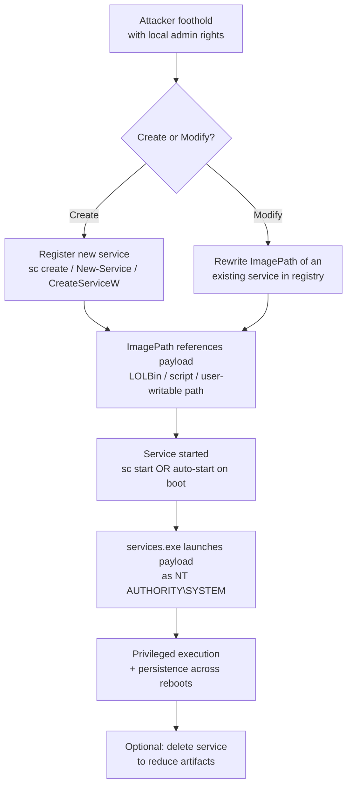

# T1543.003 — Create or Modify System Process: Windows Service

> **MITRE ATT&CK**
> **Technique:** [T1543 — Create or Modify System Process](https://attack.mitre.org/techniques/T1543/)
> **Sub-technique:** [T1543.003 — Windows Service](https://attack.mitre.org/techniques/T1543/003/)
> **Tactics:** Persistence (TA0003), Privilege Escalation (TA0004)
> **Platforms:** Windows

---

## 1. Technique Title

**Create or Modify System Process: Windows Service (T1543.003)**

---

## 2. Introduction

Windows services are background programs managed by the **Service Control Manager (SCM, `services.exe`)**. Because most services run in a highly privileged context — frequently `NT AUTHORITY\SYSTEM` — and because the SCM starts configured services automatically at boot, services are an attractive target for adversaries pursuing both **privilege escalation** and **persistence** at the same time.

An adversary with local administrator rights can abuse services in two ways:

- **Create** a brand-new service whose executable (`ImagePath`) points to a malicious binary, a script host (e.g. `powershell.exe`), or an encoded payload. When the service starts, its process runs with the service account's privileges — typically SYSTEM.
- **Modify** an existing, legitimate service by rewriting its `ImagePath` (or associated binary) so the SCM launches the attacker's payload instead of the original program the next time the service starts.

Both variants can be performed through built-in tooling (`sc.exe create`, PowerShell `New-Service`), the service-control APIs (`CreateServiceW`, `ChangeServiceConfigW`), or by directly editing the registry under `HKLM\SYSTEM\CurrentControlSet\Services\`. The technique leaves rich, reliable telemetry — new-service events, process-creation records, and registry writes — which makes it one of the more detectable privilege-escalation techniques.

A well-known example is **PsExec-style remote execution**, which installs a temporary service to run a command as SYSTEM and then deletes the service afterward — an *install → run → delete* pattern that is highly characteristic and correlatable.

---

## 3. Attack Flow

**Step-by-step:**

1. **Obtain privileges.** The adversary already holds local administrator rights on the host (service creation/modification requires them).
2. **Create or modify a service.**
   - *Create:* register a new service via `sc create`, `New-Service`, `CreateServiceW`, or a direct registry write, setting `ImagePath` to the payload.
   - *Modify:* rewrite the `ImagePath` value of an existing service in the registry to hijack it.
3. **Point at the payload.** The service binary is a malicious EXE/DLL, a LOLBin (`rundll32`, `regsvr32`, `mshta`), a script host running an encoded command, or a binary staged in a user-writable directory (`\Temp`, `\AppData`, `\ProgramData`).
4. **Execute.** The service is started immediately (`sc start`) or on the next boot (auto-start). The SCM (`services.exe`) launches the payload **as SYSTEM**.
5. **Achieve objectives.** The adversary gains privileged code execution *and* persistence that survives reboots.
6. **(Optional) Clean up.** For run-once execution (e.g. PsExec-style), the service is deleted shortly after running to minimise persistence artifacts.

**Flow diagram:**

**Data sources that observe this flow:**

| Data Source | Event | What it provides |
|---|---|---|
| Windows **System** log | **7045** | New service installed: `ServiceName`, `ImagePath`, `AccountName`, `StartType` (on by default) |
| Windows **Security** log | **4697** | New service installed (requires *Audit Security System Extension*) |
| **Sysmon** | **EID 1** | Process creation: `sc.exe` / `powershell` command lines; `services.exe` child processes |
| **Sysmon** | **EID 13** | Registry value set: modification of a service `ImagePath` |

---

## 4. Detection Strategy

The strategy combines **atomic rules** — each fires on a single event and is specific enough to alert on directly — with **correlation rules** that chain multiple events in order to expose behavior no single event reveals (service execution as SYSTEM, and install-then-delete cleanup).

Where the reliable signal is a *sequence*, the correlations depend on low-noise **base (feeder) rules** that are intentionally broad and set to `informational`. Those feeders should **not** be alerted on individually — the correlation supplies the precision.

### 4.1. Atomic Rules

| # | Rule Name | Source Event | How it helps detection |
|---|---|---|---|
| 1 | [`service_install_suspicious_imagepath_t1543`](https://github.com/zshanhyder01/Detection-Engineering/blob/main/atomic_rules/windows/detect_service_install_suspicious_imagepath_t1543/sigma.yml) | System 7045 | Flags a **new** service whose `ImagePath` is a user-writable path or LOLBin — the classic *create* variant. |
| 2 | [`service_creation_cmdline_t1543`](https://github.com/zshanhyder01/Detection-Engineering/blob/main/atomic_rules/windows/service_creation_cmdline_t1543/sigma.yml) | Sysmon EID 1 | Catches the operator action (`sc create` / `New-Service`) at command-line level, even if the 7045 event is missed or suppressed. |
| 3 | [`service_imagepath_registry_tamper_t1543`](https://github.com/zshanhyder01/Detection-Engineering/blob/main/atomic_rules/windows/service_imagepath_registry_tamper_t1543/sigma.yml) | Sysmon EID 13 | Detects the **modify** variant — rewriting an existing service's `ImagePath` in the registry — which 7045 (new-service only) never sees. |
